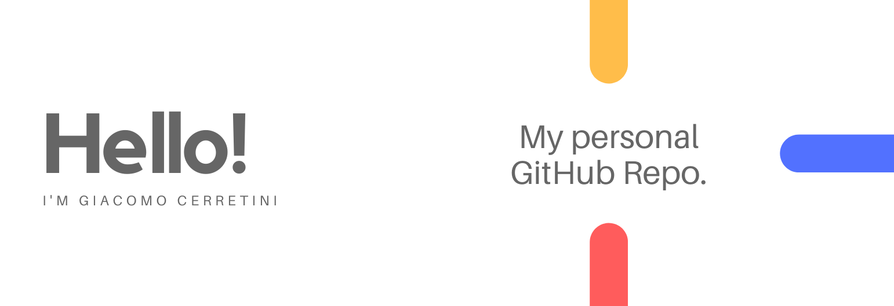

## 👋 Hi there, I'm Giacomo Cerretini!

I am a graduate student in digital humanities at the University of Pisa.
Some of my interests are:
 - 👨‍💻 develop web applications and delve into all kinds of topics and technological languages ​​for development;
 - 💻 machine learning and data scientist projects;
 - 📊 data streams and data visualization;
 - 🖌 web design;
 - 🏠 Wemos IoT application develop;
 - and more...
 

### 🔥 Languages and Frameworks:
<code></code>
<code></code>
<code></code>
<code></code>
<code></code>
<code></code>   

### ⭐ My stats:

<!--   -->

